# Napoleon AI Architecture

## Overview
Napoleon AI is a modern, AI-powered productivity platform built with Next.js 15, TypeScript, and a microservices architecture. The platform integrates multiple communication channels and provides intelligent email management with luxury UX design.

## System Architecture

### High-Level Architecture
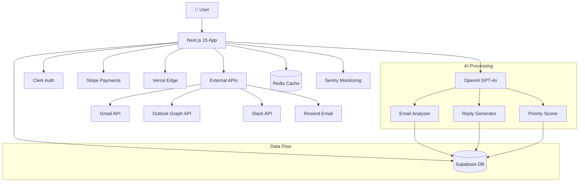

### Component Architecture
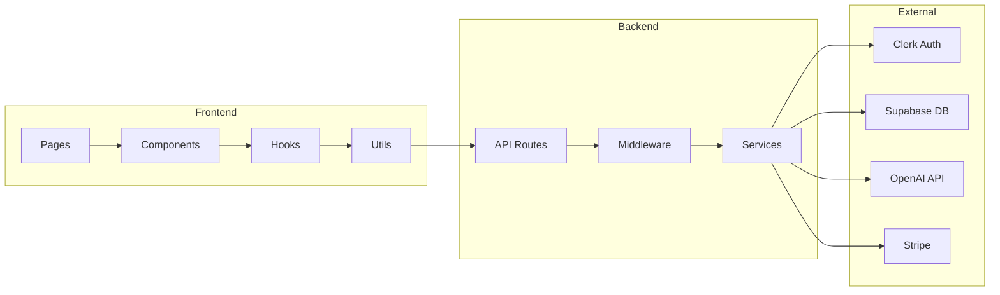

## Technology Stack

### Frontend
- **Framework**: Next.js 15 (App Router)
- **Language**: TypeScript 5.0+
- **Styling**: Tailwind CSS + Custom Design System
- **State Management**: React Hooks + Context
- **Animations**: Framer Motion
- **Forms**: React Hook Form + Zod
- **UI Components**: Radix UI + Custom

### Backend
- **Runtime**: Node.js 18+
- **Database**: Supabase (PostgreSQL)
- **Authentication**: Clerk
- **Payments**: Stripe
- **AI**: OpenAI GPT-4o
- **Email**: Resend
- **Caching**: Redis (Upstash)
- **Monitoring**: Sentry

### Infrastructure
- **Hosting**: Vercel
- **CDN**: Vercel Edge Network
- **Database**: Supabase
- **File Storage**: Supabase Storage
- **Real-time**: Supabase Realtime
- **Cron Jobs**: Vercel Cron

## Data Architecture

### Database Schema
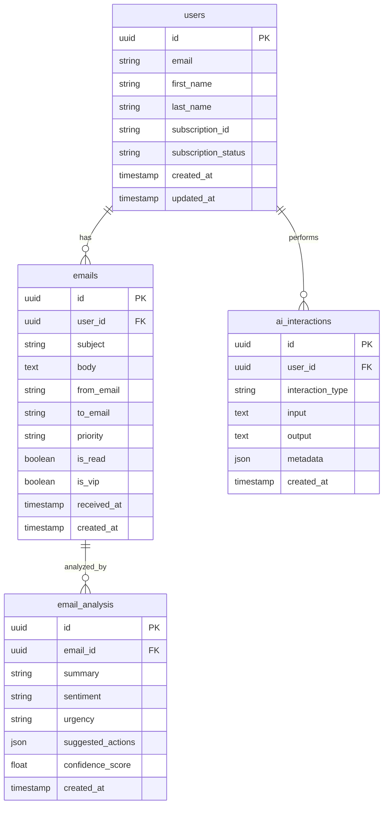

### API Architecture
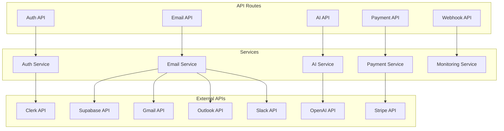

## Security Architecture

### Authentication Flow
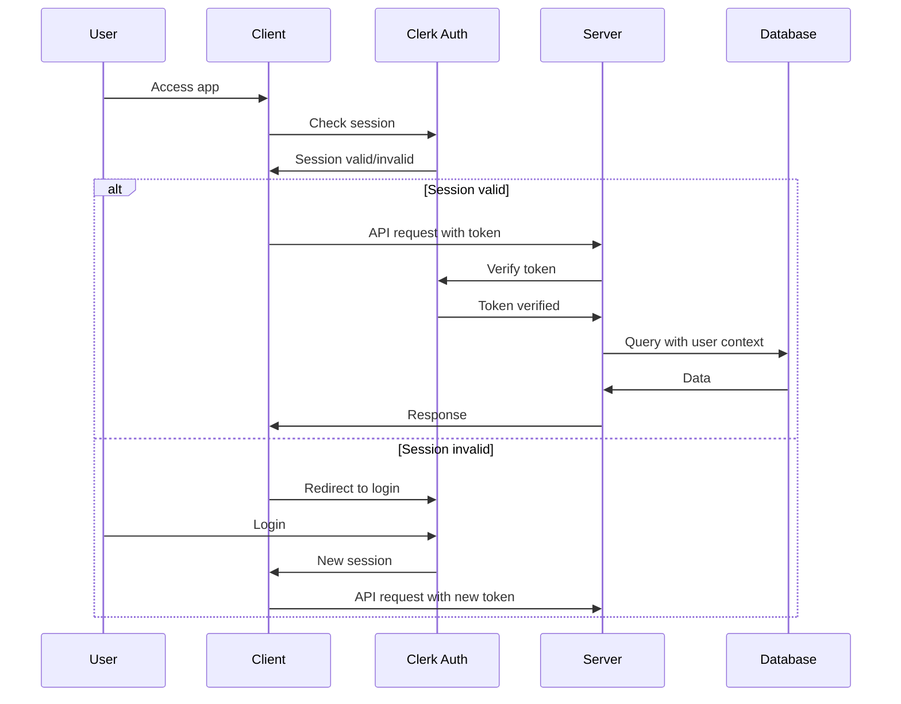

### Data Protection
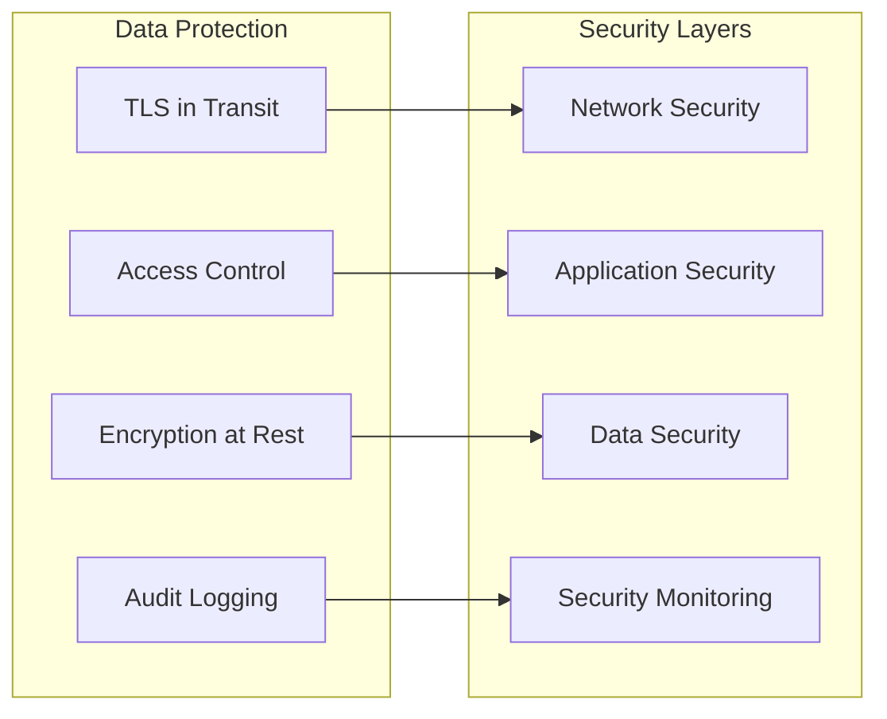

## Performance Architecture

### Caching Strategy
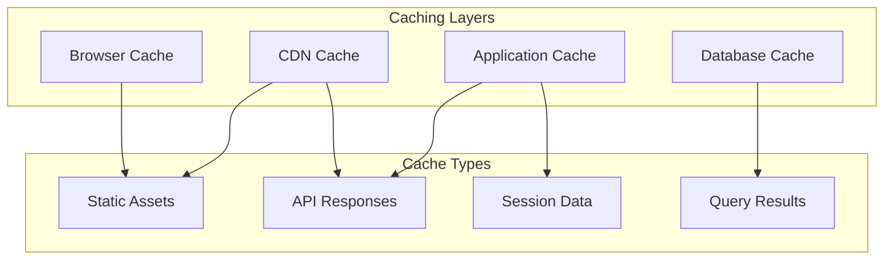

### Performance Monitoring
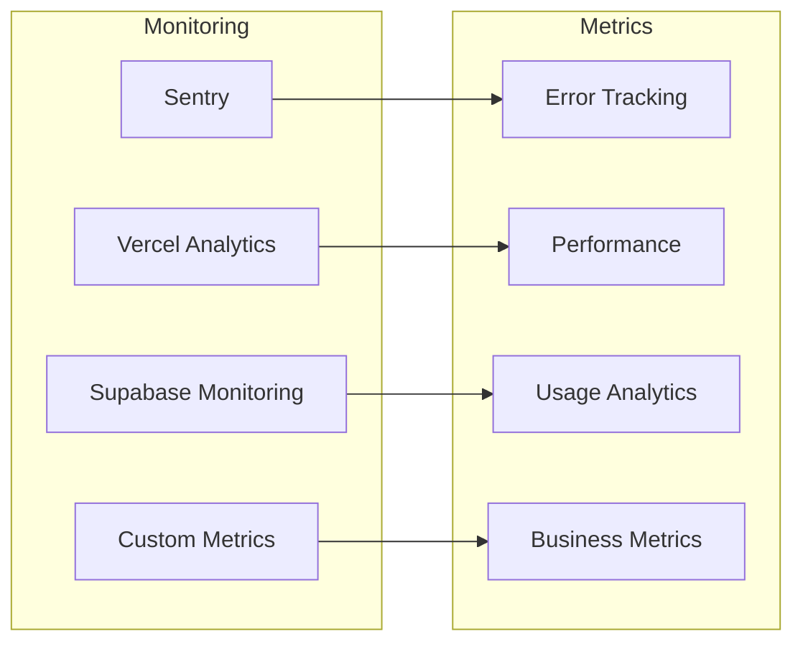

## Integration Architecture

### Email Processing Flow
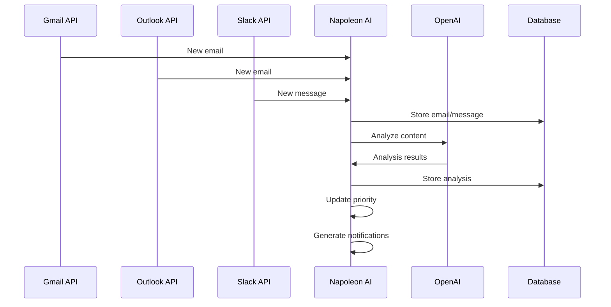

### Payment Processing Flow
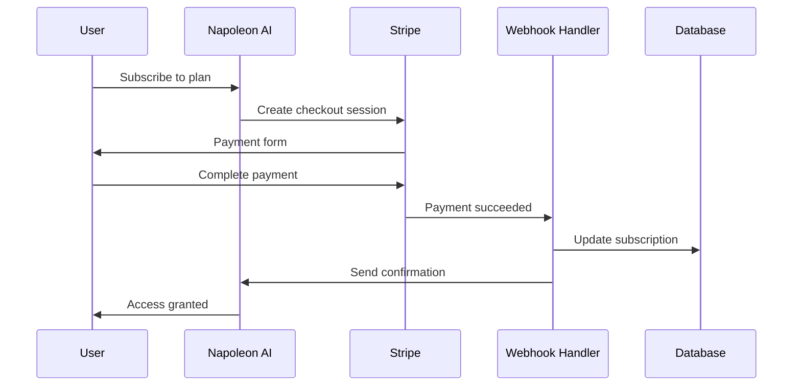

## Deployment Architecture

### Vercel Deployment
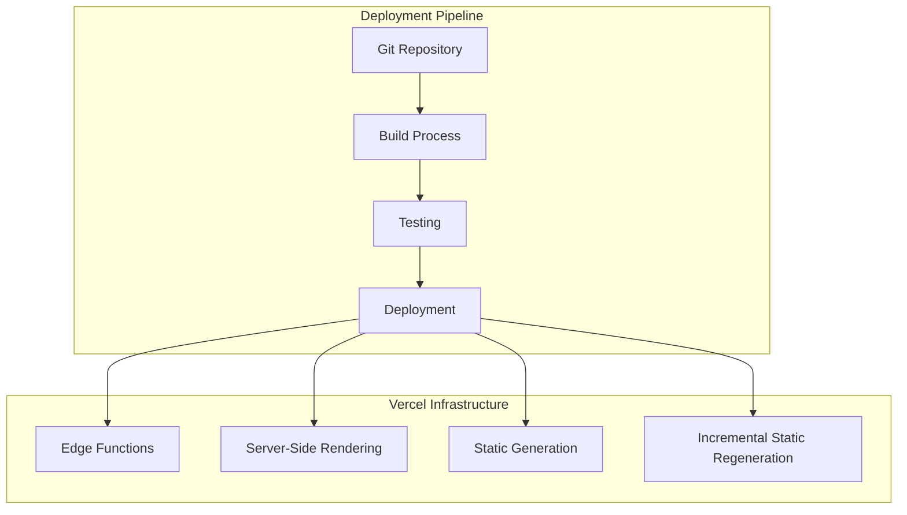

### Environment Configuration
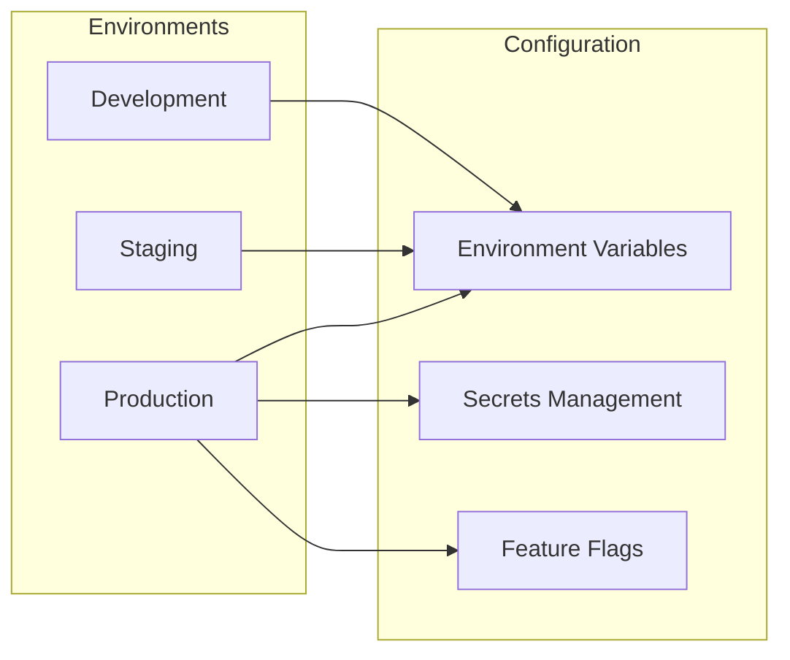

## Scalability Architecture

### Horizontal Scaling
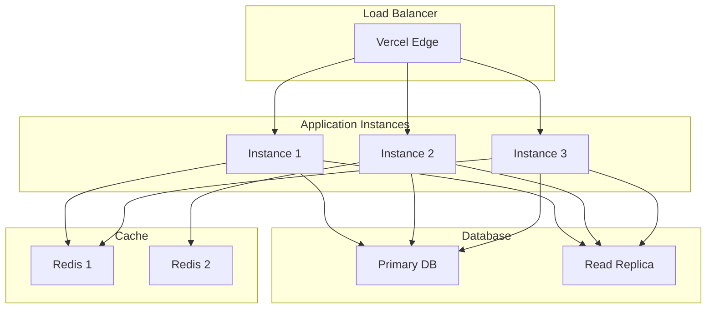

### Performance Optimization
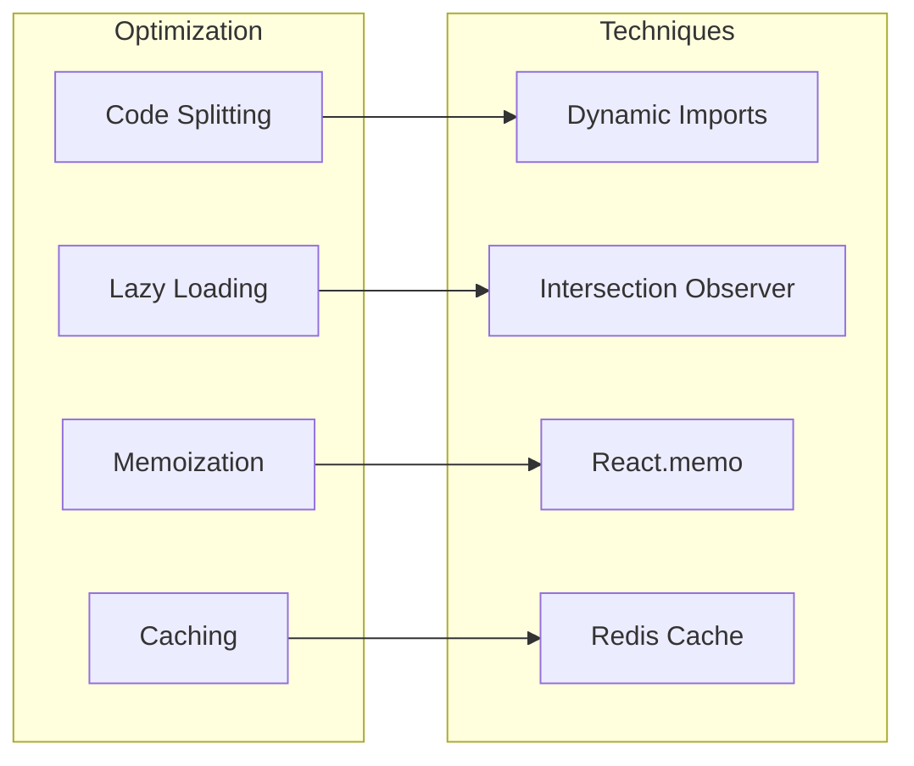

## Monitoring & Observability

### Monitoring Stack
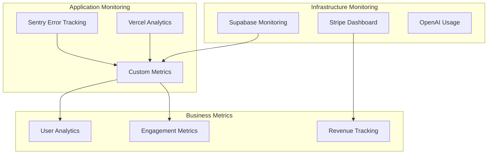

## Disaster Recovery

### Backup Strategy
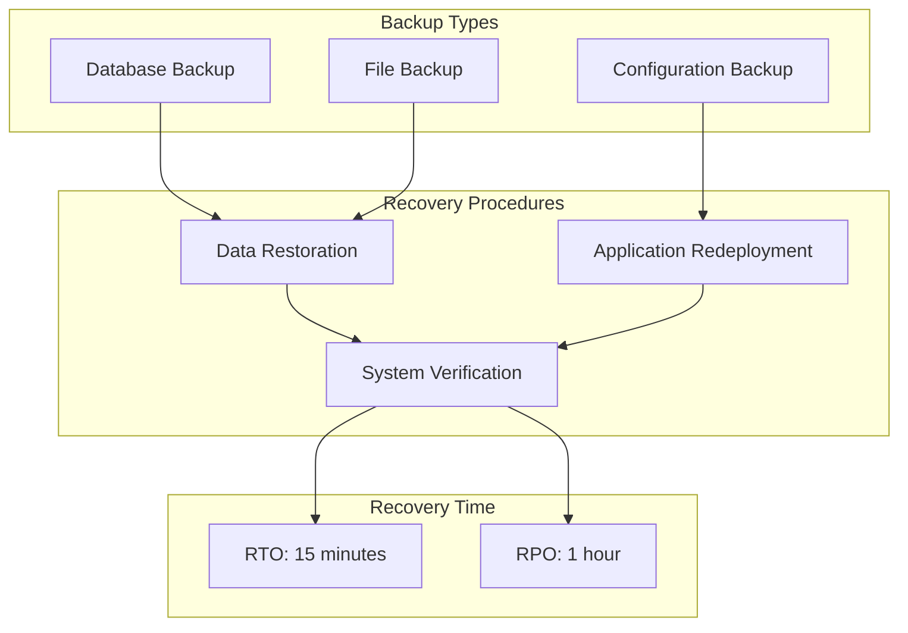

## Future Architecture Considerations

### Microservices Migration
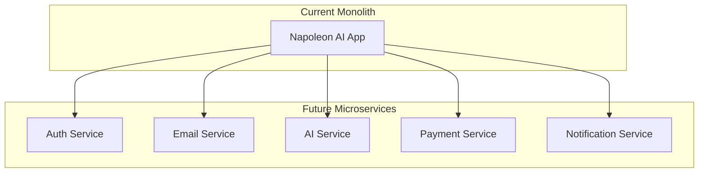

### AI/ML Pipeline
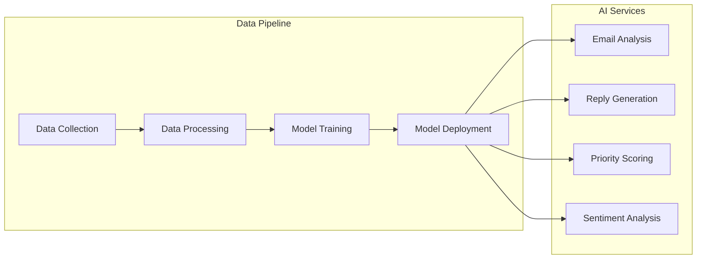

---

**Architecture Version**: 1.0  
**Last Updated**: 2024-01-15  
**Next Review**: 2024-02-15 