# Napoleon AI - System Architecture

## Overview

Napoleon AI is a modern, cloud-native application built with Next.js 15, featuring a microservices architecture optimized for performance, scalability, and security. The system transforms communication chaos into clarity through intelligent email management and AI-powered prioritization.

## High-Level Architecture

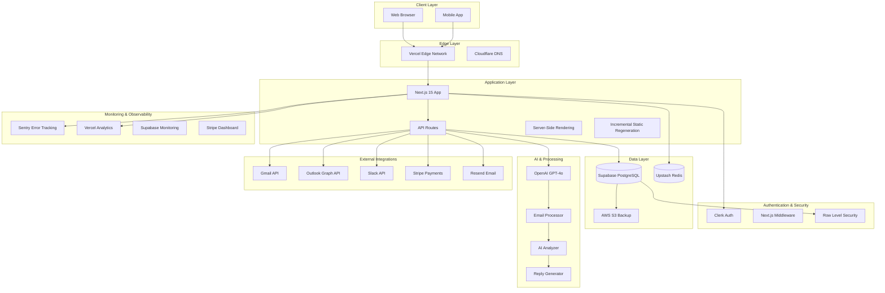

## Component Architecture

### Frontend Components

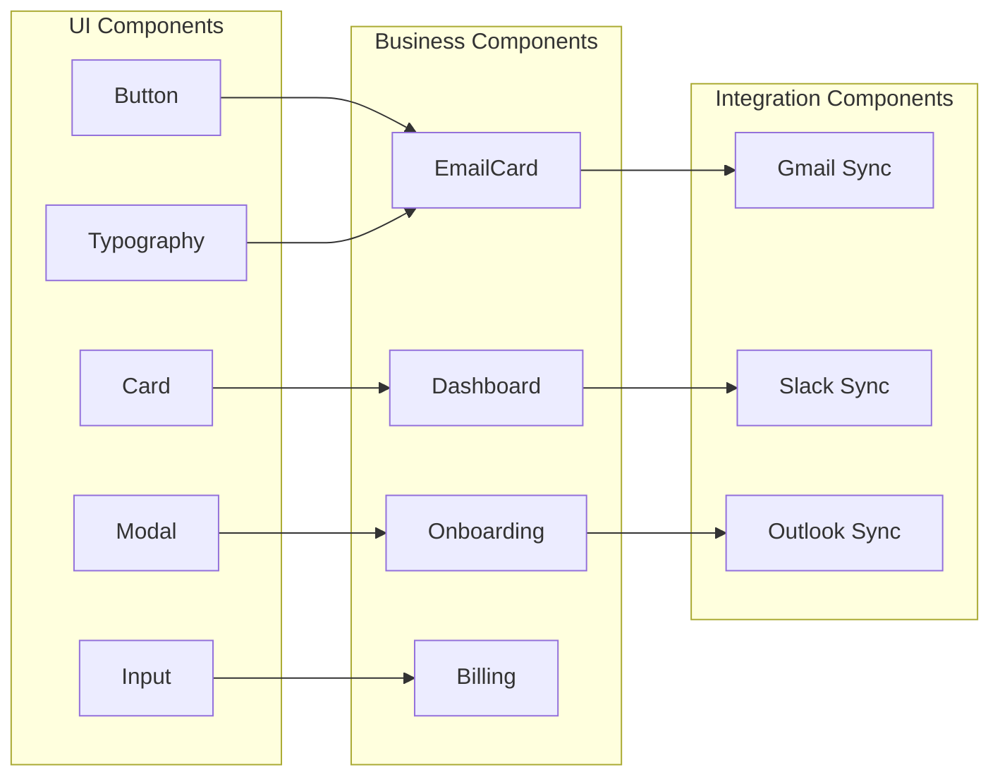

### API Architecture

```mermaid
graph TB
    subgraph "API Routes"
        AuthAPI[/api/auth/*]
        EmailAPI[/api/emails/*]
        AIAPI[/api/ai/*]
        StripeAPI[/api/stripe/*]
        WebhookAPI[/api/webhooks/*]
        HealthAPI[/api/health]
    end

    subgraph "Middleware"
        AuthMiddleware[Auth Middleware]
        RateLimit[Rate Limiting]
        CORS[CORS Headers]
        Security[Security Headers]
    end

    subgraph "Services"
        EmailService[Email Service]
        AIService[AI Service]
        PaymentService[Payment Service]
        BackupService[Backup Service]
    end

    AuthAPI --> AuthMiddleware
    EmailAPI --> RateLimit
    AIAPI --> CORS
    StripeAPI --> Security
    WebhookAPI --> AuthMiddleware
    HealthAPI --> RateLimit

    EmailAPI --> EmailService
    AIAPI --> AIService
    StripeAPI --> PaymentService
    WebhookAPI --> BackupService
```

## Data Flow

### Email Processing Pipeline

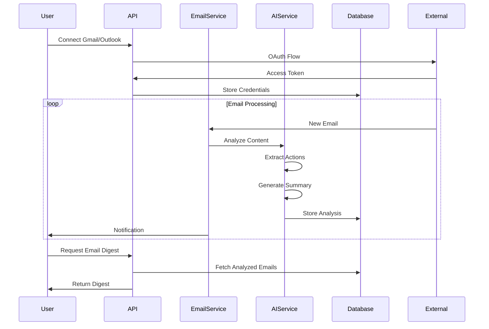

### AI Analysis Flow

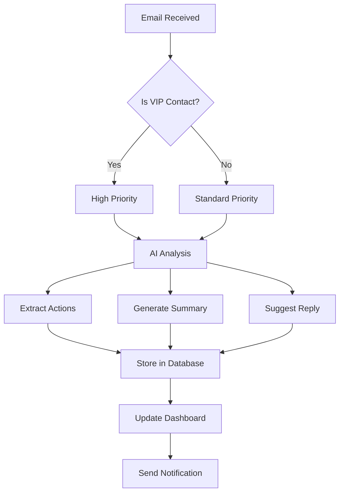

## Security Architecture

### Authentication Flow

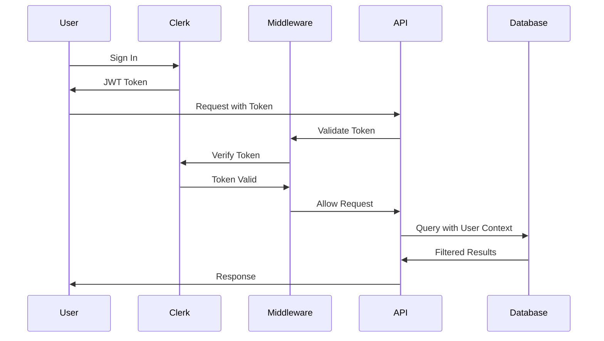

### Data Protection

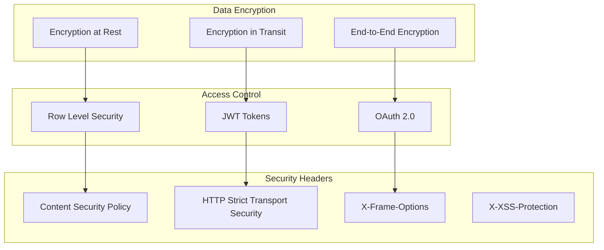

## Performance Architecture

### Caching Strategy

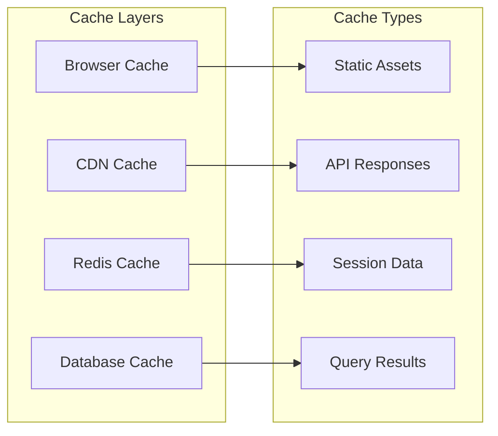

### Performance Monitoring

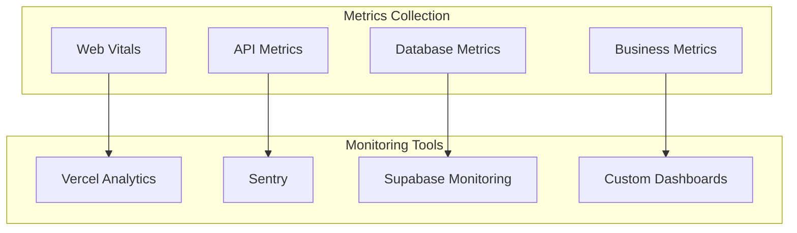

## Deployment Architecture

### Infrastructure

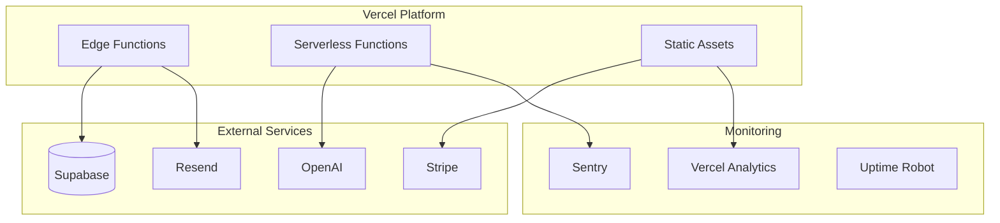

### CI/CD Pipeline

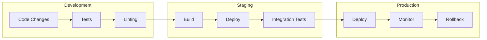

## Scalability Considerations

### Horizontal Scaling

- **Edge Functions**: Automatically scale with traffic
- **Database**: Supabase handles scaling
- **CDN**: Global edge network
- **Caching**: Redis for session management

### Vertical Scaling

- **API Routes**: Configure function memory/timeout
- **Database**: Upgrade Supabase plan
- **AI Processing**: Optimize OpenAI usage
- **Storage**: Scale S3 storage

## Disaster Recovery

### Backup Strategy

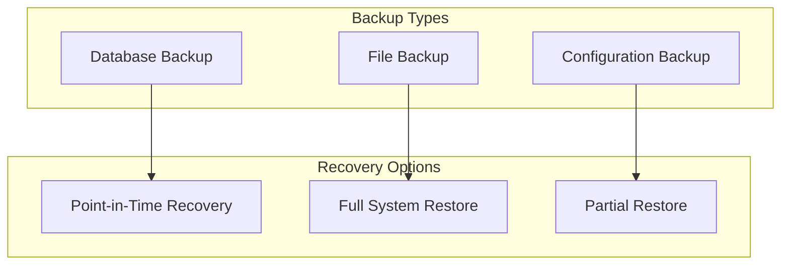

### High Availability

- **Multi-region deployment**: Vercel edge network
- **Database redundancy**: Supabase managed
- **External service fallbacks**: Multiple providers
- **Monitoring redundancy**: Multiple monitoring tools

## Technology Stack

### Frontend
- **Framework**: Next.js 15 (App Router)
- **Language**: TypeScript 5.0+
- **Styling**: Tailwind CSS
- **UI Components**: Radix UI
- **State Management**: React Hooks
- **Animations**: Framer Motion

### Backend
- **Runtime**: Node.js 18+
- **API**: Next.js API Routes
- **Authentication**: Clerk
- **Database**: Supabase (PostgreSQL)
- **Caching**: Upstash Redis
- **File Storage**: AWS S3

### AI & Integrations
- **AI Provider**: OpenAI GPT-4o
- **Email**: Gmail API, Outlook Graph API
- **Messaging**: Slack API
- **Payments**: Stripe
- **Email Service**: Resend

### DevOps & Monitoring
- **Hosting**: Vercel
- **Error Tracking**: Sentry
- **Analytics**: Vercel Analytics
- **Testing**: Vitest, Playwright
- **CI/CD**: GitHub Actions

## Future Architecture Considerations

### Planned Enhancements
- **Real-time features**: WebSocket integration
- **Advanced AI**: Custom model fine-tuning
- **Mobile app**: React Native
- **Enterprise features**: SSO, advanced permissions
- **Analytics**: Advanced user analytics
- **Performance**: Edge computing optimization

### Scalability Roadmap
- **Microservices**: Break down into services
- **Event-driven**: Message queues
- **Global deployment**: Multi-region
- **Advanced caching**: CDN optimization
- **AI optimization**: Model serving infrastructure

---

*Last updated: [Date]*
*Version: 1.0* 